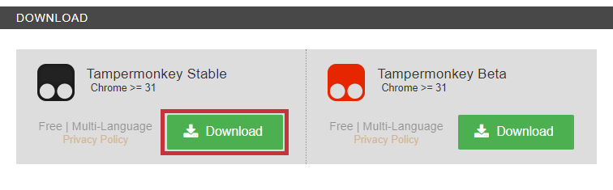
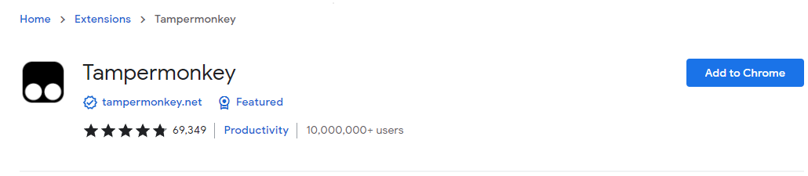
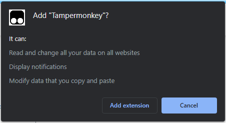
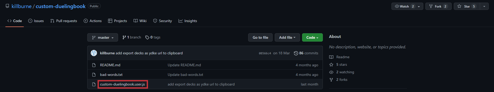
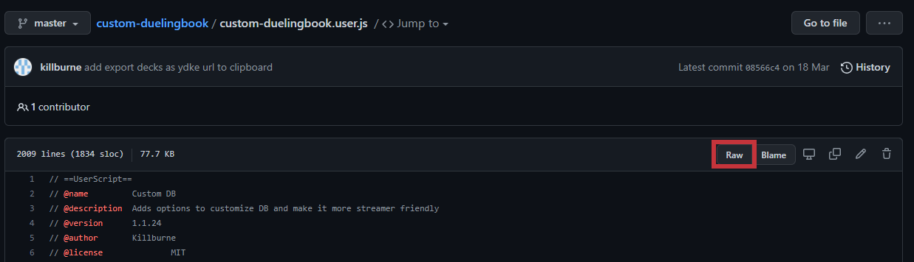
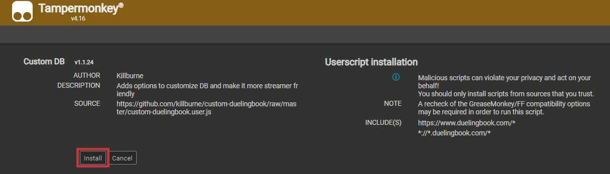
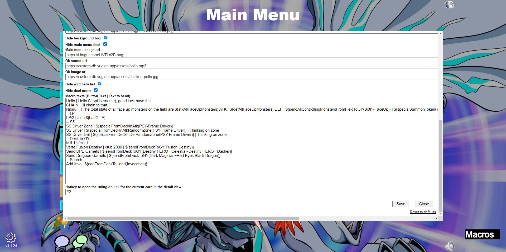
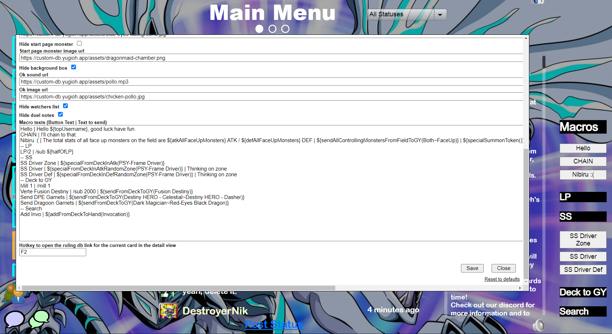
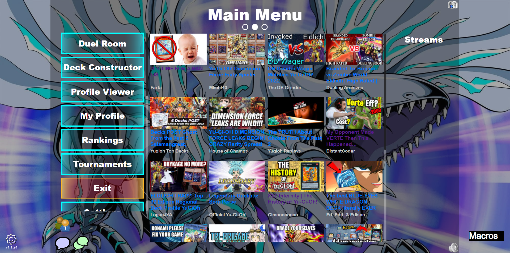

# **Tutorial**

## **Installation**

### <ins> **Tampermonkey** </ins>

Tampermonkey is the extension through which the Custom Duelingbook script can be run. It can be installed either from the [Chrome Web Store](https://chrome.google.com/webstore/detail/tampermonkey/dhdgffkkebhmkfjojejmpbldmpobfkfo?hl=en), or via its [website](https://www.tampermonkey.net/).

#### <ins> Installation via the Tampermonkey Website </ins>

1. Click the "Download" button for Tampermonkey Stable.

    

    This will take you to the Chrome Web Store page. From here, follow the Chrome Web Store installation guide.

#### <ins> Chrome Web Store Installation </ins>

1. Click "Add to Chrome".

    

1. When asked if you are sure that you want to add Tampermonkey, click "Add Extension".

    

### <ins> **Installing the Script** </ins>

1. Navigate to the [GitHub page for the Custom Duelingbook Script](https://github.com/killburne/custom-duelingbook), then click on "custom-duelingbook.user.js", or [alternatively click this link](https://github.com/killburne/custom-duelingbook/blob/master/custom-duelingbook.user.js).

    

1. On this page, click "Raw"

    

1. This will open a new tab. On this new page, click "Install". This will close the tab.

    

Installation is now complete, and the extension will now work on Duelingbook.

## How to Use Custom Duelingbook

Upon opening Duelingbook, you will see the background of the menu has been replaced with art of Blue-Eyes Alternative White Dragon, and the Nekroz of Brionac on the opening screen with Chamber Dragonmaid. You will also see 2 new buttons on the screen, labelled below as 1 and 2.

1. This is the settings button. Clicking on it will open the settings window (labelled 3 on this image)

1. This is the Macro menu. Clicking this will reveal available macros and sub-categories of macros, which can also be expanded by clicking on them. 

1. This is the settings window. This is where you are able to customise the extension to your own ends.

Below is shown the remaining options not shown above and an expanded Macro menu.

|Setting|Explanation|
|---|---|
|Active|Enables/ disables the extension. May require refreshing the page.|
|Censor chat| Hides certain words from chat messages in duels and watcher's chat.|
|Censor private chat| Does the same as the above, but for private messages.|
|Banned words list| The list of words targeted by the censor. You can change the link in order to use your own list of words.|
|Think Emote URL| The image displayed when you or your opponent press the "think" button during a game.|
|Think Text| The message sent in chat when you press the "think" button.|
|Ok Text| The message sent in chat when you click the "OK" button in a game.|
|Sleeve image url| The image used for sleeves (both yours and opponent's).|
|Profile image urls| Images used for your opponent's profile image. Having multiple links will allocate a random profile picture from the list.|
|Url for your own profile picture| The link to the image used for your own profile picture. If you wish to keep one of the DB options, simply leave this field blank.|
|Background image url| The image used as the background for DB.|
|Hide start page monster| Decide whether or not you want to see an image on the login/start menu.|
|Start page monster url| The link to the image used for the start page monster (this is Nekroz of Brionac in default DB, and Chamber Dragonmaid by default using the extension). This image will always be 1370x1370 pixels in size, and thus will be resized to compensate if it is not.|
|Hide background box| Enable/ disable the 4:3 background filter of DB (see image below).|
|Hide main menu feed| Enable/ disables the DB menu feed (statuses, tournaments and videos/streams). Requires refresh to re-enable.|
|Main menu image url| The image which is displayed in place of the Main Menu feed. Leave blank for no image tp be shown.|
|Ok sound url| URL for sound played when either player "OK"s an action via the "OK" button.|
|Ok image url| URL for image shown when either player "OK"s an action.|
|Hide watchers list| Censors names shown in the watchers list of a duel|
|Hide duel notes| Hides notes in the descriptions of existing duel rooms (eg: "no pend/xyz/synchro/link/meta".|
|Macro texts| This is where you can customise the macros available to you.|
|Hotkey for ruling db| Opens the ruling database entry for the currently displayed card when the specified key is pressed.|

DB with "Hide background box" disabled
